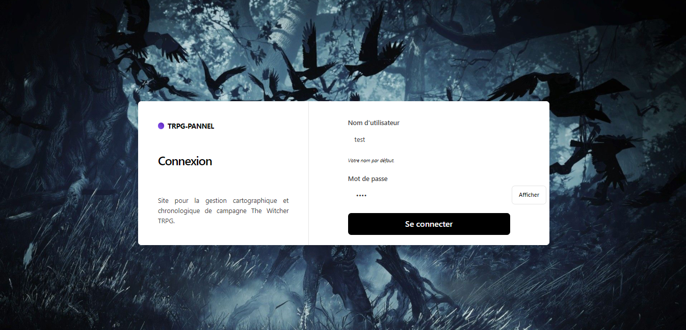
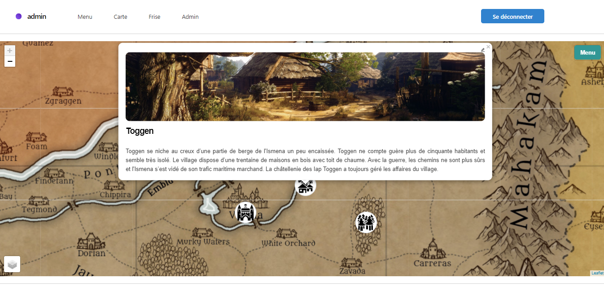
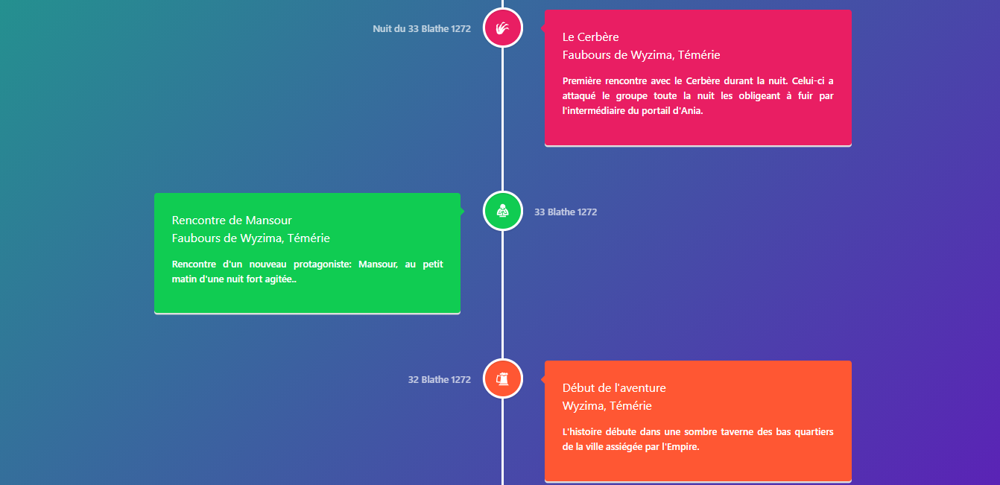

# Witcher TRPG pannel
Utilitaire en ligne pour la gestion chronologique et cartographique de campagne pour le JdR The Witcher.
* Utilisation du template Next-js-Boilerplate & React.js
* Carte interactive via React-Leaflet
* Frise interactive via React-Vertical-Timeline
* Serveur via PHP

## Liens
- [Feuille de route](https://github.com/MacNaab/trpg-pannel/projects/1)
- [Mise à jour](https://github.com/MacNaab/trpg-pannel/blob/main/UPDATE.md)

## Preview





## Build (for Static)
Cette option est utile si vous voulez un rendu Static sans devoir modifier/copier tout le répertoire.
1. Copiez les fichiers du dossier `build` et collez-les sur votre serveur.
2. Copiez également les fichiers du dossier `api`.
3. Modifiez la constante `URL` (qui correspond à la localisation du dossier `api`) pour l'adapter à votre configuration. Pour cela, remplacer `http://localhost/trpg-pannel/api/` dans les fichiers du dossier `build/_next/static/chunks` par votre localisation. Utilisez l'éditeur de texte de votre choix. 
Les fichiers à modifier sont (`admin, form, frise, home, index et map`).

## Node.js
Copiez le répertoire puis lancez la commande dans votre terminal:
```JS
npm install
```
Ensuite, vous pouvez exécuter localement en mode développement:
```JS
npm run dev
```
Ouvrez http://localhost:3000 avec votre navigateur préféré pour voir votre projet.

Vous aurez besoin d'un serveur pour utiliser toutes les fonctionnalités. Modifiez la constantes: (`AppConfig.ts`)
```JS
const  URL = "http://localhost/trpg-pannel/api/";
```
par la localisation de votre serveur PHP.

----

Vous pouvez voir les résultats localement en mode production avec :
```
npm run build
npm run start
```
Les fichiers HTML et CSS générés sont minifiés (fonctionnalité intégrée de Next js). Il supprimera également les CSS inutilisés de [Tailwind CSS](https://tailwindcss.com).

Vous pouvez créer une version de production optimisée avec :
```
npm run build-prod
```
Maintenant, votre projet est prêt à être déployé. Tous les fichiers générés sont situés dans le dossier `out`, que vous pouvez déployer avec n'importe quel service d'hébergement.

----

## Arbre du projet
```
├── README.md # README file

├── next.config.js # Next JS configuration

├── public # Public folder

│ └── assets

│ └── images # Image used by default template

├── src

│ ├── components # Les composants des différentes pages

│ ├── layout # Atomic layout components

│ ├── pages # Next JS pages

│ ├── styles # PostCSS style folder with Tailwind

│ ├── templates # Default template

│ └── utils # AppConfig.ts

├── tailwind.config.js # Tailwind CSS configuration

└── tsconfig.json # TypeScript configuration
```
---